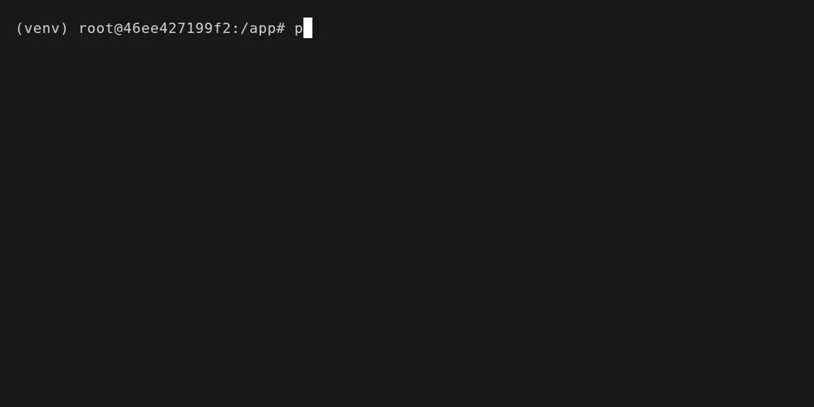
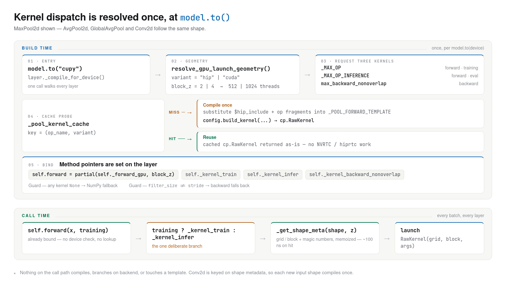
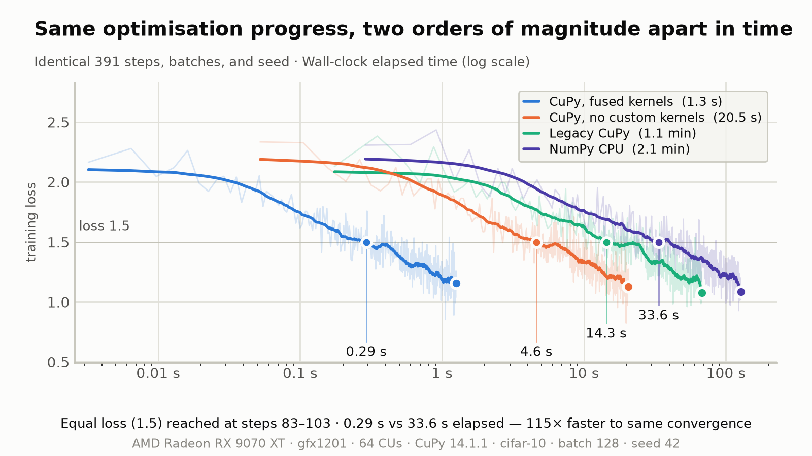
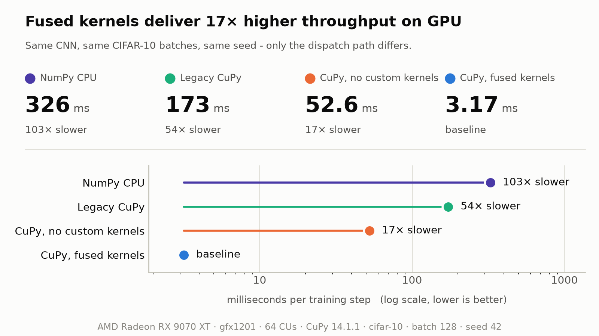
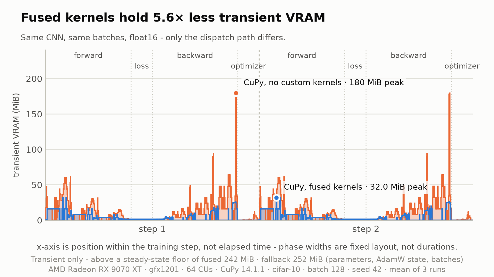

# Aether-ML

A deep learning framework built from the ground up based on two numerical libraries **NumPy** and **CuPy**, with hand written GPU kernels for both **CUDA** and **ROCm**.  
  
[](https://github.com/AlexanderSoftCode/Aether-ML/actions/workflows/tests.yml)
[](https://www.python.org/)
[](https://rocm.docs.amd.com/)
[](https://opensource.org/licenses/MIT)

## Why Aether-ML?

Aether-ML implements forward and backward propagation, convolutional and fully connected networks, normalization, pooling, and losses without building directly off any existing deep learning libraries. *NumPy* provides powerful `ndarray` datatypes that vectorize operations; *CuPy* ports this existing logic to the GPU, giving the extra functionality of custom GPU kernels speeding up an already embarrassingly parallel task. 

The GPU path is **NOT** a thin wrapper over vectorized array operations, and it does not rely on an `xp` alias for a unified layer pass. Instead, convolution, pooling, batch normalization, dropout, spatial dropout, loss, Adam, and AdamW each run as hand-written kernels compiled from source templates targeting both **NVIDIA** and **AMD** hardware. To combat CPU overhead, all fronts including device backend, kernel-variant selection, and layer building are all resolved ahead of time at model construction, and never re-evaluated on every call.

Aether-ML is an intentionally ground-up project born knowing nothing about machine-learning nor GPU kernel programming. However, rather than promote a weak mental model of machine learning and how deep learning frameworks work, the goal was to implement how deep learning runtimes work under the hood. With this approach, all system level decisions, hardware dispatch, and memory footprints had to be resolved, building real knowledge about architecting and maintaining real, production-style software.  



---

## Key Features

**Layers** — `Conv2d`, `Dense`, `BatchNorm`, `MaxPool2d`, `AvgPool2d`, `GlobalAvgPool`, `Dropout`, `SpatialDropout`, `ReLU`, `LeakyReLU`, `Softmax`, with He initialization (He et al.) and Philox counter-based PRNG for dropout masks (Salmon et al.)

**Kernels** — Hand-written CUDA and HIP kernels for every compute layer, magic-number integer division (Granlund & Montgomery) for on-device index decomposition, and numerical stability guards on optimizer moment denominators, standard scaling, and loss terms

**Training** — AdamW with decoupled weight decay (Loshchilov & Hutter), L1 and L2 regularization executed inside the optimizer kernel, label smoothing within categorical cross entropy (Guo et al.), batch shuffling, in-training validation, and throttled progress reporting, and mixed precision via `set_precision`, which casts most layers while forcing FP32 in the optimizer, Softmax, and BatchNorm for numerical stability.  

**Serialization** — `.aether` bundles pairing a JSON architecture manifest with `safetensors` weights, with no pickle anywhere in the load path, so an untrusted checkpoint cannot execute code. Preprocessor state is captured in the manifest, so a loaded model normalizes its own inputs

**Preprocessing** — `Compose` pipelines with `Rescale`, `StandardScaler`, and `ToTensor`

---

## Installation

Aether-ML requires python 3.12 or newer. It depends on NumPy and `safetensors` and runs on the CPU out of the box. For GPU accelerated workloads via CuPy, separate wheels per vendor and toolkit version, it's recommended to follow their installation steps.

```bash
git clone https://github.com/AlexanderSoftCode/Aether-ML.git
cd Aether-ML

python -m venv .venv
source .venv/bin/activate        # Windows: .venv\Scripts\activate

# Install editable package with serialization support
pip install -e .

# For NVIDIA, matching your installed CUDA toolkit; choose one wheel
pip install cupy-cuda12x
pip install cupy-cuda13x # Best for Turing and newer
```

**AMD ROCm**: Pre-built CuPy wheels depend on a specific ROCm driver version (e.g. `pip install cupy-rocm-7-0`). Refer to the [CuPy ROCm installation guide](https://docs.cupy.dev/en/latest/install.html#using-cupy-on-amd-gpu-experimental) for supported driver targets. For users with the ROCm 7.14.x and a GPU that supports said version, the repository includes a VS Code dev container under `.devcontainer/rocm-gfx1201/` for the AMD configuration.

---

## Quickstart 


A complete model lifecycle, from construction to a saved model.
<details>
<summary>Click to view a complete three-block CNN</summary>

```python
import aether as ae
import numpy as np
import cupy as cp

TARGET_DEVICE="cupy"
feature_pipeline = ae.Compose([
    ae.ToTensor(dtype='float32', target_device=TARGET_DEVICE),
    ae.Rescale(factor=1.0 / 255.0),
    ae.StandardScaler()
])
# Setup
model = ae.Model()
model.manual_seed(seed=42) #applies for all compute and PRNG based layers

model.add(ae.Conv2d(3, 32, (3, 3), (1, 1), padding="same"))
model.add(ae.BatchNorm(epsilon=1e-5, momentum=0.9))
model.add(ae.ReLU())
model.add(ae.MaxPool2d((2, 2), (2, 2), padding="valid"))

model.add(ae.Conv2d(32, 64, (3, 3), (1, 1), padding="same"))
model.add(ae.BatchNorm(epsilon=1e-5, momentum=0.9))
model.add(ae.LeakyReLU())
model.add(ae.MaxPool2d((2, 2), (2, 2), padding="valid"))
model.add(ae.SpatialDropout(rate=0.1))

model.add(ae.Conv2d(64, 128, (3, 3), (1, 1), padding="same"))
model.add(ae.BatchNorm(epsilon=1e-5, momentum=0.9))
model.add(ae.ReLU())
model.add(ae.MaxPool2d((2, 2), (2, 2), padding="valid"))
model.add(ae.SpatialDropout(rate=0.1))

model.add(ae.GlobalAvgPool())
model.add(ae.Dense(128, 128, l2=2e-5))
model.add(ae.Dropout(rate=0.075))

model.add(ae.Dense(128, 10))

model.configure(
    loss=ae.SoftmaxCategoricalCrossEntropy(label_smoothing=0.05),
    optimizer=ae.AdamW(lr=0.001, decay=1e-4, weight_decay=0.01),
    accuracy=ae.CategoricalAccuracy(),
    preprocessor=feature_pipeline   # Optional, see examples/cifar10/
)
model.to(TARGET_DEVICE)
model.finalize(input_shape=X_train.shape[1:])

model.train(X=X_train, 
    y=y_train, 
    epochs=25, 
    batch_size=128, 
    shuffle=True,
    print_every=100,
    validation_data=(X_test, y_test)
)

model.evaluate(X=X_test, y=y_test, batch_size=128)
model.save(filepath="saved_models/quickstart.aether")

# --- In a separate evaluation / deployment script ---
model = ae.Model.load("saved_models/quickstart.aether")
predictions = model.predict(X_raw)
```
</details>
  
The accuracy here should converge to **75-77% test accuracy** on CIFAR-10 across 25 epochs. For end to end dataset pipelines, mixed-precision configurations, routing model to a fused kernel path, and proper saving and loading functionality, see the complete scripts inside [`examples/cifar10/`](examples/cifar10/)

---

## Architecture

Four decisions shape most of the codebase.

**Resolution happens once, not per call.** `model.to()` triggers `_compile_for_device` on every layer, swapping method pointers to backend-specific implementations and selecting kernel variants ahead of time. The alternative is checking the active backend inside each forward pass, costing a branch per layer per batch, for a decision that cannot change between calls. The cost is that layers have two lifecycle phases; an uncompiled construction phase and a compiled execution phase.

One exception is deliberate. The `training` flag stays a plain runtime boolean, because resolving it ahead of time would double the bound variants in every layer to save tens of nanoseconds per layer.

<picture>
  <source media="(prefers-color-scheme: dark)" srcset="notebooks/assets/Architecture_dispatch_dark.png">
  <source media="(prefers-color-scheme: light)" srcset="notebooks/assets/Architecture_dispatch.png">
  
</picture>

**One kernel source, two vendors.** `cupy.RawKernel`s in the framework are generated from a shared template, with vendor substitution maps for CUDA and HIP supplying the divergent pieces: intrinsic names, launch geometry, matrix-core APIs. This does not affect kernel performance, only an extra step during compilation.

**Kernels compile per shape, not per call.** Convolution kernels are cached on shape metadata, with filter size and stride baked in as compile-time constants rather than passed as arguments, letting the compiler unroll inner loops and fold index arithmetic. The cost is a compile on first encounter of each new shape, and a cache that grows with shape diversity, which is acceptable when shapes stay stable across thousands of training steps.

**Optional components are objects, not `None`.** The `Accuracy`, `Optimizer`, `Preprocessor`, and `TrainingProgress` components all include an optional `Null` object variant. This removes `if x is not None` from the training loop, further reducing CPU overhead during training.

---

## Benchmarks

All figures below come from the same CNN, the same CIFAR-10 batches, the same seed, and the same hardware (AMD RX 9070 XT, Intel Core Ultra 265K). Only the dispatch path differs.

### Convergence
Four paths are tested; NumPy on CPU, legacy pre-refactor GPU implementation, vectorized CuPy without custom kernels, and the fused kernel path.  
  
<picture>
  <source media="(prefers-color-scheme: dark)" srcset="notebooks/assets/benchmark_convergence-dark.png">
  <source media="(prefers-color-scheme: light)" srcset="notebooks/assets/benchmark_convergence.png">
  
</picture>

### Throughput

Per training step: **3.17 ms** on the fused kernel path vs **52.6 ms** on vectorized CuPy on the same GPU, with **326 ms** for NumPy on CPU. With the GPU paths, the kernel work shows a **17x speedup against identical hardware running array operations**.
  
<picture>
  <source media="(prefers-color-scheme: dark)" srcset="notebooks/assets/benchmark_throughput-dark.png">
  <source media="(prefers-color-scheme: light)" srcset="notebooks/assets/benchmark_throughput.png">
  
</picture>

### Transient VRAM 

Transient VRAM footprint over two training steps. Unfused CuPy dispatches allocate independent temporary buffers in VRAM for intermediate steps, resulting in transient spikes up to **180 MiB**. Custom fused kernels eliminate the need to create temporary buffers by executing multiple actions in the same kernel within registers and shared memory, reducing peak transient VRAM by **5.6×** (32.0 MiB peak).  
  
<picture>
  <source media="(prefers-color-scheme: dark)" srcset="notebooks/assets/benchmark_vram-dark.png">
  <source media="(prefers-color-scheme: light)" srcset="notebooks/assets/benchmark_vram.png">
  
</picture>

**On the legacy series.** "Legacy CuPy" contains a `float64` type promotion bug that was found during the rewrite. GPUs often have very few or no FP64 ALUs, which explains the slowdown. The pathway is still included as an honest before-and-after, and not as a competitive baseline.

---

## Testing

```bash
python3 -m unittest discover tests
```

A single invocation exercises **both the NumPy and CuPy paths**, so the dual-backend claim is verified rather than asserted. Coverage includes:

- Numerical gradient checks on every compute layer
- Unit tests for losses, optimizers, preprocessing transforms, and the test harness itself
- Integration tests covering full `Model` lifecycles including `Compose` pipelines and save/load round trips

---

## Limitations and Scope

- **No NCHW input shapes.** Tight coupling between the **NHWC** layout and the kernels was required for maximum throughput. The alternative would've been to support both tensor shapes, and find workarounds for the non-contiguous array views that **NCHW** brings.
- **No autograd.** Every backward pass is written by hand. This is not an omission, and outside the scope of this project.
- **Single GPU.** No data or model parallelism.
- **No learning rate scheduling**, early stopping, or checkpointing.
- **No gradient clipping.** The numerical guards in the optimizer and loss protect against division by zero; they do not bound gradient magnitude.
- **Two accuracy metrics**: categorical and regression.
- **Fused kernel selection is automatic.** When CuPy is present, the fused path is used; there is no runtime switch to force the vectorized path. A workaround can still be made, but a user-facing place is not made.
- **CI covers the CPU path only.** GitHub Actions runners have no GPU, so the CuPy and kernel tests are skipped there and verified locally.
- **Tested on the configurations listed above.** Other devices should work, but they have not been verified.

---

## Future Work

* [ ] **Transformer Block** — Implementation of a general transformer block and **ViT** transformer block into the framework, with the fallback vectorized path as well as a fused kernel path. 
* [ ] **Fused Forward Pass Epilogue Support** — Currently, layers such as *ReLU* and *LeakyReLU* are not fused together at the end of the compute layers epilogue (e.g. *Conv2d*, *Dense*), combining the two layers into a single kernel pass promotes faster forward passes.
* [ ] **Custom Linear Kernel** — Support for a simple GEMM kernel utilizing matrix/tensor cores from the AMD/NVIDIA GPUs, plan is to fuse the dot product as well as the bias add here, and have it compatible with both dense and transformer block.
* [ ] **Data augmentation pipeline** — passed into `configure`, applied per mini-batch (Gaussian blur, flips, rotations, inversion)

---

## Origins

This project began as an implementation of *Neural Networks from Scratch in Python* by Harrison Kinsley and Daniel Kukieła, and has since diverged considerably from it. Three breaks are worth naming.

**Data flow.** The book mutates a `self.output` attribute on each layer. Aether-ML returns its outputs instead, which saves VRAM in layers such as `Dense` and `BatchNorm`, while enabling construction-time dispatch binding.

**Backends.** The book is NumPy only. Aether-ML dispatches to hand-written kernels across two GPU vendors from a shared template.

**Scope.** Convolution, pooling, and GPU execution do not appear in the book. Those are original implementations here, along with the kernel caching, vendor templating, and layer build phase that support them.

The pre-refactor implementations are preserved under `examples/legacy/` for anyone who wants to see the first era of this project.

---

## References

* **NNFS Book**: Kinsley, H., & Kukieła, D. (2020). *Neural Networks from Scratch in Python*.

* **Adam Optimizer**: Kingma, D. P., & Ba, J. (2014). *Adam: A Method for Stochastic Optimization*. arXiv preprint arXiv:1412.6980.

* **AdamW Optimizer**: Loshchilov, I., & Hutter, F. (2017). *Decoupled Weight Decay Regularization*. arXiv preprint arXiv:1711.05101.

* **Batch Normalization**: Ioffe, S., & Szegedy, C. (2015). *Batch Normalization: Accelerating Deep Network Training by Reducing Internal Covariate Shift*. In Proceedings of the 32nd International Conference on Machine Learning (ICML) (pp. 448-456).

* **He Initialization**: He, K., Zhang, X., Ren, S., & Sun, J. (2015). *Delving Deep into Rectifiers: Surpassing Human-Level Performance on ImageNet Classification*. In Proceedings of the IEEE International Conference on Computer Vision (ICCV) (pp. 1026-1034).

* **Label Smoothing**: Guo, C., Pleiss, G., Sun, Y., & Weinberger, K. Q. (2017). *On Calibration of Modern Neural Networks*. In Proceedings of the 34th International Conference on Machine Learning (ICML) (pp. 1321-1330).

* **Philox PRNG**: Salmon, J. K., Moraes, M. A., Dror, R. O., & Shaw, D. E. (2011). *Parallel Random Numbers: As Easy as 1, 2, 3*. In Proceedings of International Conference for High Performance Computing, Networking, Storage and Analysis (SC) (pp. 1-12).

* **Integer Division via Multiplication**: Granlund, T., & Montgomery, P. L. (1994). *Division by Invariant Integers Using Multiplication*. In Proceedings of the ACM SIGPLAN Conference on Programming Language Design and Implementation (PLDI) (pp. 61-72).

* **CIFAR-10 Dataset**: Krizhevsky, A. (2009). *Learning Multiple Layers of Features from Tiny Images* (Tech. Rep. TR-2009). Department of Computer Science, University of Toronto.

---

## License 

MIT License ([LICENSE](LICENSE))

The implementation preserved under `examples/legacy/` descends from the MIT-licensed Python code accompanying *Neural Networks from Scratch in Python* and carries its own [LICENSE](examples/legacy/LICENSE) retaining the original copyright notice.